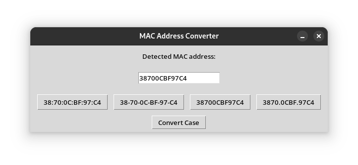

# MAC ADDRESS CONVERTER

Convert MAC Addresses to different conventions on the fly as they are copied to the clipbboard.

This script will listen for a MAC address to be copied. Once it detects that a MAC address is copied, a window will appear automatically allowing you to change the format of the copied MAC address.



## Prerequisites

You must have [python installed](https://www.python.org/downloads/). This script also uses the [pyperclip](https://pypi.org/project/pyperclip/) library.

## Installation

1. Copy the script to the desired location on your local machine.
2. Open the directory where you saved the script in a terminal window.
3. You may run the script simply by running `py mac_address_converter.py` at this point OR you may choose to automate starting and stoping this script when you log in and log out.

## Automatically start and stop per user session

### For Linux:

#### Create a Systemd Service:

Create a service file, e.g., `mac_address_converter.service`, in `~/.config/systemd/user/`:

```text
[Unit]
Description=MAC Address Formatter Script
After=graphical-session.target

[Service]
ExecStart=/usr/bin/python3 /home/bmclay/scripts/mac_address_converter/mac_address_converter.py --debug
Restart=always
# Use Wayland-specific environment variables
Environment="WAYLAND_DISPLAY=wayland-0"
# Set XDG_RUNTIME_DIR, as Wayland requires it for session information
Environment="XDG_RUNTIME_DIR=/run/user/%U"
# Redirect output for debugging
StandardOutput=append:/home/bmclay/scripts/logs/mac_address_converter_output.log
StandardError=append:/home/bmclay/scripts/logs/mac_address_converter_error.log

[Install]
WantedBy=default.target
```

Replace `/path/to/mac_address_converter.py` with the full path to your script.

#### Enable the Service:

##### Run the following commands to enable and start the service:

    systemctl --user enable mac_address_converter.service
    systemctl --user start mac_address_converter.service

##### Stop on Logout:

systemd will stop the service when you log out.

### For Windows:

WARNING: UNTESTED!!!

#### Create a Batch File:

Save the Python script in a known location (e.g., `C:\Scripts\mac_address_converter.py`).
Create a batch file (e.g., start_mac_address_converter.bat) with the following content:

    @echo off
    pythonw "C:\Scripts\mac_address_converter.py"

pythonw runs the script without opening a command prompt window.

#### Add to Startup Folder:

Press `Win + R`, type `shell:startup`, and press `Enter`. This opens the Startup folder.
Place the batch file in this folder. The script will run automatically upon login.

#### Stop the Script on Logout:

Windows will terminate the script when you log out because it’s running as part of your session.

### For macOS:

WARNING: UNTESTED!!!

#### Create a Launch Agent:

Create a plist file to define the script as a launch agent.
Save this file as com.user.mac_address_converter.plist in the ~/Library/LaunchAgents/ directory.
Example plist file:

```xml
<?xml version="1.0" encoding="UTF-8"?>
<!DOCTYPE plist PUBLIC "-//Apple//DTD PLIST 1.0//EN" "http://www.apple.com/DTDs/PropertyList-1.0.dtd">
<plist version="1.0">
<dict>
    <key>Label</key>
    <string>com.user.mac_address_converter</string>
    <key>ProgramArguments</key>
    <array>
        <string>/usr/bin/python3</string>
        <string>/path/to/mac_address_converter.py</string>
    </array>
    <key>RunAtLoad</key>
    <true/>
</dict>
</plist>
```

Replace `/path/to/mac_address_converter.py` with the full path to your script.

#### Load the Agent:

Run the following command to load the agent:

    launchctl load ~/Library/LaunchAgents/com.user.mac_address_converter.plist

#### Stop on Logout:

macOS automatically stops launch agents when you log out.

## Testing:

Log out and back in to ensure the script starts automatically.

### To manually stop the script:

#### Linux

`systemctl --user stop mac_address_converter.service`

#### Windows

Open Task Manager, find the script under "Background processes," and end it.

#### macOS

`launchctl unload`.
